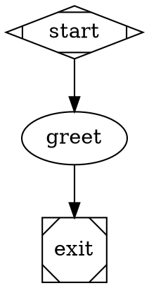
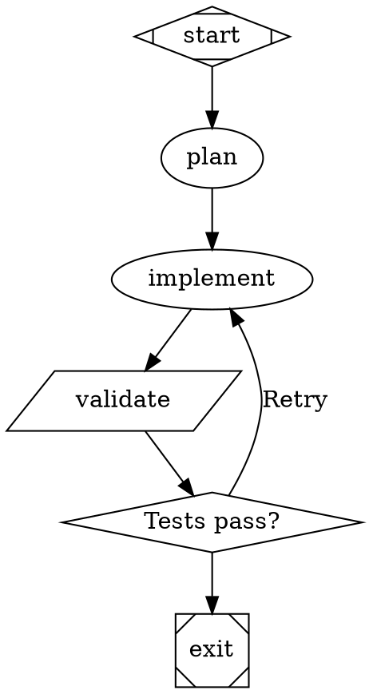

# Attractor Workflow Builder

Use this skill for workflow authoring in `attractor-pi-dev`.

This repo is not Factorial. Keep the workflow language grounded in Attractor's actual implementation, docs, and tests.

## Start Here

1. Inspect the target `.dot` file and any nearby `prompts/` or `.attractor/commands/`.
2. Read [`references/node-types.md`](references/node-types.md) for the supported shapes and explicit handler types.
3. Read [`references/attributes.md`](references/attributes.md) when you need exact attribute names, context keys, or routing rules.
4. Borrow patterns from repo examples before inventing new syntax:
   - `examples/ralph-wiggum/pipeline.dot`
   - `examples/spec-to-beads/pipeline.dot`
   - `packages/attractor-cli/tests/golden/workflows/*.dot`
5. Validate before handoff with the local CLI binary available in the environment:
   - `attractor validate workflow.dot`
   - `attractor-pi validate workflow.dot`

When behavior is unclear, verify against:
- `docs/user/language-spec.md`
- `docs/user/cookbook.md`
- `docs/user/cheatsheet.md`
- `packages/attractor-core/tests/`

## Critical Differences From The Factorial Skill

- Tool execution is `shape=parallelogram` with `tool_command`, not Factorial-style tool nodes such as `tool_name="spawn_agent"`.
- Governance handlers use Attractor's namespaced attributes:
  - `judge.input_key`, `judge.threshold`, `judge.criteria`
  - `failure.input_key`, `failure.hints`
  - `confidence.threshold`, `confidence.score_key`, `confidence.failure_class_key`, `confidence.escalate_classes`
  - `quality.checks` as a JSON array string
- Parallel fan-out uses `shape=component`; fan-in uses `shape=tripleoctagon`.
- Manager supervision is first-class through `shape=house` / `type="stack.manager_loop"`.
- Variables must come from `graph[vars]`; when `vars` is declared, undeclared `$name` references are validation errors.
- Context keys are a closed set produced by the engine and handlers. Do not invent `ctx.*` writes or assume arbitrary LLM output becomes routable context.
- Prompt resolution supports:
  - inline prompt text
  - `@relative/file.md`
  - `/command` lookup through `.attractor/commands/`, home commands, and `ATTRACTOR_COMMANDS_PATH`

## Authoring Checklist

- Define exactly one `start` node with `shape=Mdiamond`.
- Define at least one `exit` node with `shape=Msquare`.
- Use bare identifiers for node IDs; put human-readable text in `label`.
- Prefer prompt files for long instructions instead of large inline strings.
- Use `thread_id` and `fidelity` intentionally when multiple LLM stages should share context.
- Use edge `condition` and `weight` for routing; do not rely on unsupported custom routing fields.
- Keep governance flows deterministic by routing on built-in keys like `outcome`, `human.gate.selected`, `tool.output`, `judge.rubric.*`, or `confidence.gate.*`.
- Validate after edits, then dry-run with simulation if the workflow shape changed.

## Common Patterns

### Linear LLM Flow



### Implement / Validate Loop



### Human Approval

```dot
review [shape=hexagon, label="Review Changes"]
review -> ship [label="[A] Approve"]
review -> fix  [label="[F] Fix"]
```

### Governance Flow

```dot
judge [type="judge.rubric", prompt="Review the artifact", judge.input_key="last_response", judge.threshold="0.8"]
gate  [type="confidence.gate", confidence.threshold="0.8"]
route [shape=diamond, label="Route"]

judge -> gate -> route
route -> auto  [condition="confidence.gate.decision=autonomous"]
route -> human [condition="confidence.gate.decision=escalate"]
```

### Parallel Fan-Out / Fan-In

```dot
fan_out [shape=component, label="Parallelize", max_parallel=2]
merge   [shape=tripleoctagon, label="Merge"]

start -> fan_out
fan_out -> branch_a
fan_out -> branch_b
branch_a -> merge
branch_b -> merge
merge -> exit
```

### Manager Loop

```dot
digraph Managed {
    graph [goal="Supervise a child workflow", stack.child_dotfile="./child.dot"]

    start   [shape=Mdiamond]
    manager [shape=house, label="Manager", manager.actions="observe,steer,wait"]
    exit    [shape=Msquare]

    start -> manager -> exit
}
```

## Validation And Debugging

- Validate structure first:
  - `attractor validate workflow.dot`
- Exercise routing without live model calls:
  - `attractor run workflow.dot --simulate --verbose`
- Capture backend/tool diagnostics when needed:
  - `attractor run workflow.dot --debug-agent`
- If a route is surprising, check the relevant built-in context key rather than assuming custom state exists.

## When To Read More

- Use [`references/node-types.md`](references/node-types.md) for quick node selection.
- Use [`references/attributes.md`](references/attributes.md) for exact attribute names, handler outputs, and routable context keys.
- Use `docs/user/cookbook.md` for larger patterns.
- Use `docs/user/language-spec.md` when you need grammar or validation-rule details.
